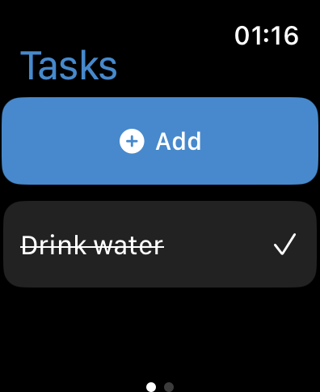
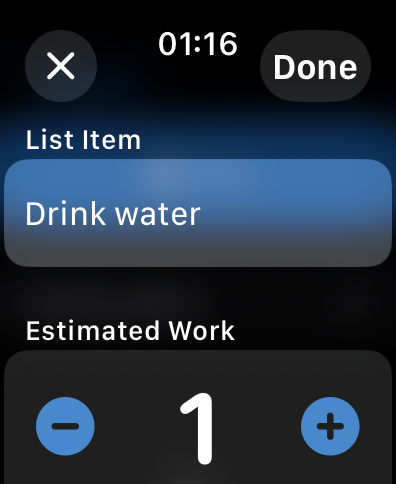

Please go under edit and edit this file as needed for your project.  There is no seperate documentation needed.

# Project Name - Task Management Application
# Student Id - IT20668136
# Student Name - Hettiarachchi H A T T 

#### 01. Brief Description of Project - 
The project is a task management application designed specifically for iOS and Apple Watch users. The app will enable users to create, update, delete, and mark tasks as complete directly from their Apple Watch. This convenience ensures that users can manage their to-do lists on-the-go without needing to constantly reach for their iPhone. The application will be built using Swift and will leverage WatchKit for the Apple Watch interface.
#### 02. Users of the System - 
*Busy Professionals
*Fitness Enthusiasts
*Students
#### 03. What is unique about your solution -
*Watch-First Design
*Minimalist Interface:
*can select complited workes 

#### 04. Briefly document the functionality of the screens you have (Include screen shots of images)

  
this is the main screen that the user sees upon launching the app. It displays an overview of the tasks for the day.

  
This screen is used to create a new task.

#### 05. Documentation 

(a) Design Choices

(b) Why would someone want to invest on your project idea

(c) Further enhancements you propose

(d) How would you commercialize this product

#### 06. Reflection

Challenges that you faced in doing this part of the assingment (other than know technical issues of getting hold of a proper Mac machine).
How would have approached this Assignment differently.

  

